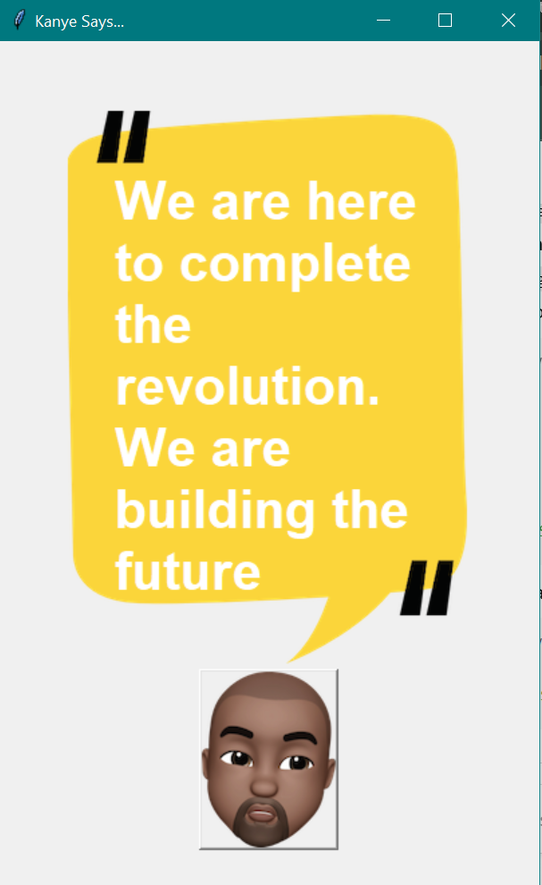

# 🎤 Kanye Says...

A fun Python project that displays random Kanye West quotes using the [Kanye Rest API](https://kanye.rest).  
Built with **Tkinter** for the GUI and **Requests** for fetching quotes.

---

## 📌 Features
- Fetches a **random Kanye West quote** on button click  
- Simple and clean **Tkinter interface**  
- Uses **Canvas** with styled text and images  
- Lightweight and beginner-friendly

---

## 🚀 Getting Started

### 1) Clone the repository
    git clone https://github.com/your-username/kanye-says.git
    cd kanye-says

### 2) Install dependencies
    pip install requests

### 3) Run the project
    python main.py

---

## 📂 Project Structure
    ├── background.png     # Background image for the canvas
    ├── kanye.png          # Kanye button image
    ├── main.py            # Main Python script
    └── README.md          # Project documentation

---

## 🖼️ Preview
Here’s how the app looks in action:  

---

## 📦 Requirements
- Python 3.x  
- `requests` (install via `pip install requests`)  
- Tkinter (bundled with most Python distributions)

---

## 🔧 How It Works
- The app creates a Tkinter window with a canvas and a Kanye button.  
- On button click, it calls the Kanye Rest API to fetch a random quote.  
- The quote text on the canvas is updated using `canvas.itemconfig(quote_text, text=quote)`.

---

## ✨ Future Improvements
- Add multiple quote sources (other APIs)  
- Save favorite quotes locally  
- Improve GUI styling with themes

---

